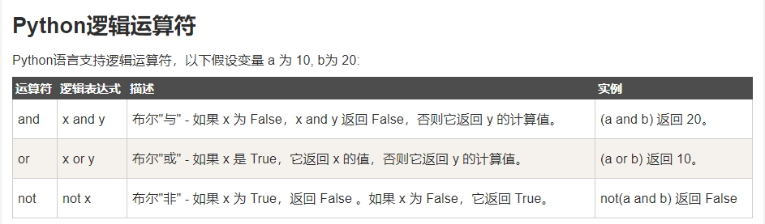

---
title: python知识点
date: 2019-06-28 18:02:39
tags:
---

###### 引用，深拷贝与浅拷贝

1、b = a: 赋值引用，a 和 b 都指向同一个对象。


2、b = a.copy(): 浅拷贝, a 和 b 是一个独立的对象，但他们的子对象还是指向统一对象（是引用）。


b = copy.deepcopy(a): 深度拷贝, a 和 b 完全拷贝了父对象及其子对象，两者是完全独立的。


```python
kvps = { '1' : [1,1], '2' : [2,2] }
theCopy = kvps.copy()
kvps['1'].append(2)
print(theCopy)    #拷贝所有父对象，子对象共有，所以改变子对象两个都改变。
```

    {'1': [1, 1, 2], '2': [2, 2]}


```python
kvps = { '1' : 1, '2' : 2 }
theCopy = kvps.copy()
kvps['1'] = 5
print(theCopy)    #拷贝所有父对象，改变一个不影响其他。
```

    {'1': 1, '2': 2}


```python
kvps = { '1' : [1,1], '2' : [2,2] }
theCopy = kvps.copy()
kvps['1'] = [3,3]
print(theCopy)    #拷贝所有父对象，子对象共有，但第一个重新指向新列表，改变第一个，第二个不变。
```

    {'1': [1, 1], '2': [2, 2]}


```python
import copy
a = [1, 2, 3, 4, ['a', 'b']] #原始对象
 
b = a                       #赋值，传对象的引用
c = copy.copy(a)            #对象拷贝，浅拷贝
d = copy.deepcopy(a)        #对象拷贝，深拷贝
 
a.append(5)                 #修改对象a
a[4].append('c')            #修改对象a中的['a', 'b']数组对象
 
print( 'a = ', a )
print( 'b = ', b )
print( 'c = ', c )
print( 'd = ', d )
```

    a =  [1, 2, 3, 4, ['a', 'b', 'c'], 5]
    b =  [1, 2, 3, 4, ['a', 'b', 'c'], 5]
    c =  [1, 2, 3, 4, ['a', 'b', 'c']]
    d =  [1, 2, 3, 4, ['a', 'b']]


###### Python中的对象包含三要素：

id、type、value

其中id用来唯一标识一个对象，type标识对象的类型，value是对象的值

is判断的是a对象是否就是b对象，是通过id来判断的

如果a,b为字符串不可变类型，指向相同地址，所以  a is b

==判断的是a对象的值是否和b对象的值相等，是通过value来判断的


```python
a='123'
b='123'
```


```python
a is b
```


    True


###### python中的布尔值

下列对象的布尔值都是False：

NONE;

False(布尔类型)

所有的值为零的数

       0（整型）

       0.0（浮点型）

       0L(长整型)

       0.0+0.0j(复数)

""(空字符串)

[](空列表)

()(空元组)

{}(空字典)

###### python中主要存在四种命名方式：

1、object #公用方法

2、_object #半保护
                 #被看作是“protect”，意思是只有类对象和子类对象自己能访问到这些变量，
                  在模块或类外不可以使用，不能用’from module import *’导入。
                # __object 是为了避免与子类的方法名称冲突， 对于该标识符描述的方法，父
                  类的方法不能轻易地被子类的方法覆盖，他们的名字实际上是
                  _classname__methodname。
                  
3、_ _ object  #全私有，全保护
                       #私有成员“private”，意思是只有类对象自己能访问，连子类对象也不能访
                          问到这个数据，不能用’from module import *’导入。
4、_ _ object_ _     #内建方法，用户不要这样定义

###### Python语言中有关复数的概念：

1、虚数不能单独存在，它们总是和一个值为0.0的实数部分一起构成一个复数

2、复数由实数部分和虚数部分构成

3、表示虚数的语法：real+imagej

4、实数部分和虚数部分都是浮点数

5、虚数部分必须有后缀j或J

复数的内建属性：

复数对象拥有数据属性，分别为该复数的实部和虚部。

复数还拥有conjugate方法，调用它可以返回该复数的共轭复数对象。

复数属性：real(复数的实部)、imag(复数的虚部)、conjugate()（返回复数的共轭复数）

###### python 装饰器

[python函数装饰器](https://www.runoob.com/w3cnote/python-func-decorators.html)

###### 列表 ，元组，字典，集合

1、Python 中的 tuple 结构为 “不可变序列”，用小括号表示。为了区别数学中表示优先级的小括号，当 tuple 中只含一个元素时，需要在元素后加上逗号。如（1，）


###### 字符串

Python 中字符串的前导 r 代表原始字符串标识符，该字符串中的特殊符号不会被转义，适用于正则表达式中繁杂的特殊符号表示。

最典型的例子，如要输出字符串 \n，由于反斜杠的转义，因此一般的输出语句为：


```python
print('\\n')
```

    \n


```python
print(r"\\n")
```

    \\n





```python
a = 'a'
print(a > 'b' or 'c')
```

    c


```python
a = 'a'
print(a > 'b' or 'c'>'d')
```

    False


```python
a = 'a'
print(a < 'b' or 'c')
```

    True


```python
a = 'a'
print(a < 'b' and 'c')
```

    c


###### map() 

map() 会根据提供的函数对指定序列做映射。

第一个参数 function 以参数序列中的每一个元素调用 function 函数，返回包含每次 function 函数返回值的新列表。

map() 函数语法：
map(function, iterable, ...)

参数
function -- 函数
iterable -- 一个或多个序列

返回值
Python 2.x 返回列表。

Python 3.x 返回迭代器。


```python


```


```python

```
