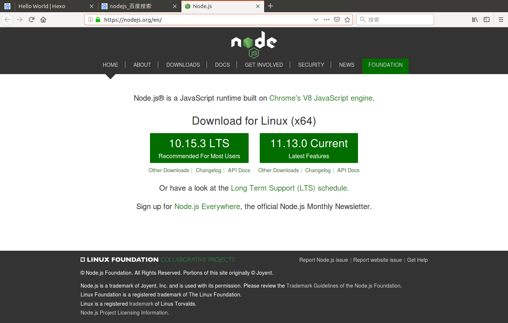
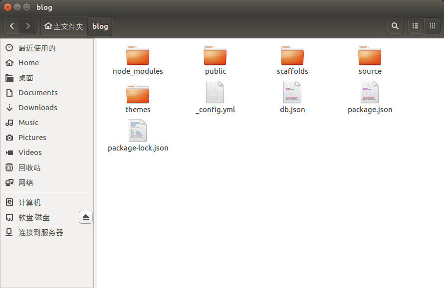
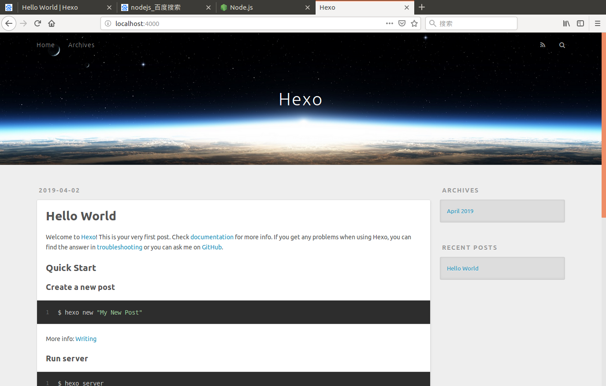
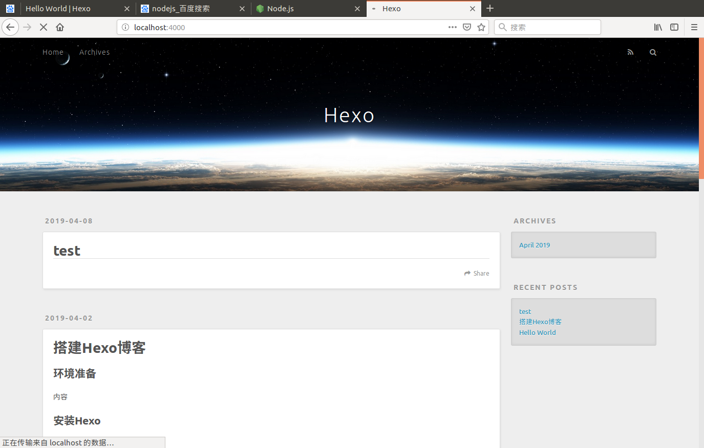
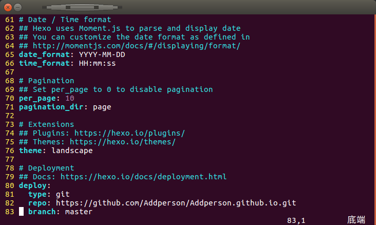
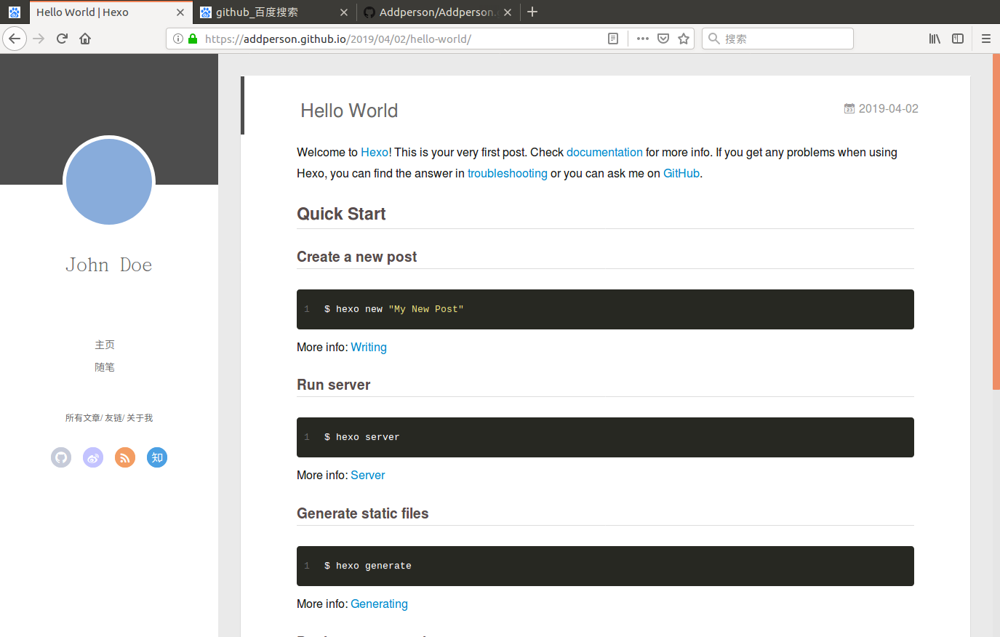

## 环境准备
1.下载[Nodejs](https://nodejs.org/en/)



2.进入终端，查看安装是否成功

```bash
node -v

npm -v
```
3.下载cnpm并且安装hexo框架

```bash
npm install -g cnpm --registry=https://registry.npm.taobao.org

cnpm -v                    ----查看安装成功

cnpm install -g hexo-cli   ----安装hexo

hexo -v                    ----查看安装成功

```


## 建立本地博客

1.进入用户家目录（/home/user）,新建文件夹blog

```bash
cd ~

mkdir blog                ----此文件夹就是博客目录，博客资源都在此处

hexo init

```


```bash
hexo s            ---启动博客，在本地4000端口打开,如图1
hexo n "test"     ---新建博客文章test
hexo c            ---清除
hexo g            ---生成
hexo s            ---再次启动博客，此时博客更新，如图2

#具体hexo命令介绍可自行查找理解
```

<center>图1</center>


<center>图2</center>


## 通过Github部署博客到远端

1.在Github新建仓库，名称必须为：‘用户名’.github.io
2.安装插件：
```bash
cnpm install --save hexo-deployer-git

```
3.配置文件_config.yml,添加到 #Deployment



4.部署到Github
```bash
hexo d
```
5.浏览器打开 ‘用户名’.github.io

## 主题下载

从网上下载hexo主题的代码到本地，例如：

```bash
git clone https://github.com/litten/hexo-theme-yilia.git
```
此时在blog的theme文件夹下有一个新文件夹yilia，修改配置文件_config.yml
```bash
#Extensions
theme:yilia
```
可以通过上图找到所在位置，修改完毕后，清理生成再部署就会生成新主题




#### 参考文献
https://www.bilibili.com/video/av44544186?from=search&seid=5533406106430612562
